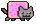
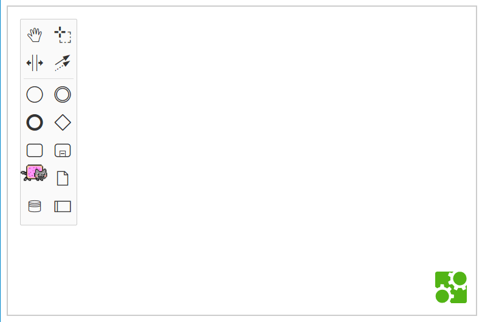

> :notebook: If you're interested in custom elements head over to [custom-elements](https://github.com/bpmn-io/bpmn-js-examples/tree/master/custom-elements) to get an overview first.


# bpmn-js-nyan

[](https://travis-ci.org/bpmn-io/bpmn-js-nyan)

[bpmn-js](https://github.com/bpmn-io/bpmn-js) +  = auto-win.

This projects bundles lovely nyan cats into a custom BPMN 2.0 modeler.


## About

Stand out and integrate nyan cats into your next BPMN Modeler!




## Great Features

* [Custom Colors](./lib/color-picker)
* [Nyan Cats](./lib/nyan)
* [Resize all elements](./lib/resize-all-rules)


## Usage

```javascript
import BpmnModeler from 'bpmn-js/lib/Modeler';

import resizeAllModule from 'bpmn-js-nyan/lib/resize-all-rules';
import colorPickerModule from 'bpmn-js-nyan/lib/color-picker';
import nyanDrawModule from 'bpmn-js-nyan/lib/nyan/draw';
import nyanPaletteModule from 'bpmn-js-nyan/lib/nyan/palette';


var bpmnJS = new BpmnModeler({
  additionalModules: [
    resizeAllModule,
    colorPickerModule,
    nyanDrawModule,
    nyanPaletteModule
  ]
});
```


## Building

To build, lint and test the project run

```
npm install
npm run all
```

To spin up the test interactively in the browser, execute

```
npm run dev
```

Visit [localhost:9876/debug.html](http://localhost:9876/debug.html) in your browser.


## Related

If you enjoy nyan cats you might be interested in these related examples, too:

* [Colors](https://github.com/bpmn-io/bpmn-js-examples/tree/master/colors)
* [Custom Elements](https://github.com/bpmn-io/bpmn-js-examples/tree/master/custom-elements)
* [Custom Modeling Rules](https://github.com/bpmn-io/bpmn-js-examples/tree/master/custom-modeling-rules)
* [Theming](https://github.com/bpmn-io/bpmn-js-examples/tree/master/theming)


## License

MIT
