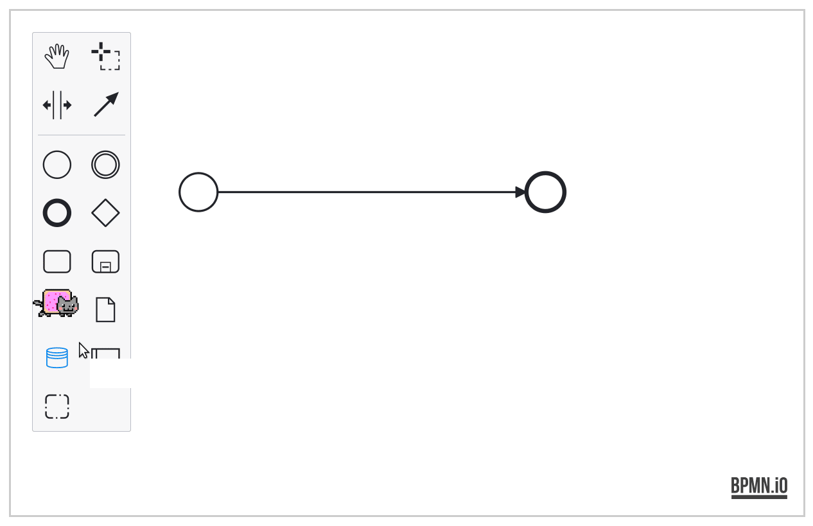

# bpmn-js-nyan

[](https://travis-ci.org/bpmn-io/bpmn-js-nyan)

[bpmn-js](https://github.com/bpmn-io/bpmn-js) +  = auto-win.

This projects bundles lovely nyan cats into a custom BPMN 2.0 modeler.


## Nyan cat in your next BPMN modeler




## Great things not in bpmn-js

* [Resize all elements](./lib/resize-all-rules)
* [Nyan Cats](./lib/nyan)
* [Custom Colors](./lib/color-picker)


## Building

To build, lint and test the project run

```
npm install
npm run all
```

To spin up the test interactively in the browser, execute

```
npm run dev
```

Visit [localhost:9876/debug.html](http://localhost:9876/debug.html) in your browser.


## License

MIT
